# GatherGrove

Multi-tenant SaaS for clubs and community organizations: membership, events, payments,
communications, and analytics. A .NET 9 API, a Next.js 15 web app on Cloudflare Workers, and a React
Native client, built over 13 months.

> [!IMPORTANT]
> This repository is a portfolio piece: a snapshot of a product built solo from 2025-05-28 to
> 2026-07-08. The only numbers here are ones measured by running the code.

> [!NOTE]
> Built by [Angel Campa](https://github.com/AngelCampa1). Source-available for viewing and
> evaluation, not open source, no redistribution or commercial use. See [License](#license).

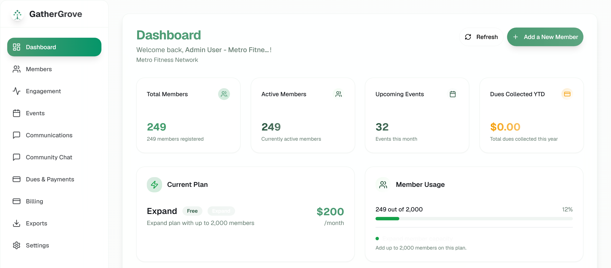

<sub>Every screenshot here is the real application running locally against a seeded PostgreSQL database of 3 clubs across all pricing tiers. None of them is retouched; the image above is the full-size capture cropped to its top half. Re-capture against your own seeded database with `cd e2e && npm run screenshots`; the seeder is unreliable on event creation, so counts will differ from what is shown here.</sub>

---

## Contents

- [What it does](#what-it-did)
- [Architecture](#architecture)
- [Stack](#stack)
- [Where the thirteen months went](#where-the-thirteen-months-went)
- [By the numbers](#by-the-numbers)
- [Testing](#testing)
- [Screenshots](#screenshots)
- [Repository map](#repository-map)
- [Documentation](#documentation)
- [Built with AI agents](#built-with-ai-agents)
- [Running it locally](#running-it-locally)
- [Who built this](#who-built-this)
- [License](#license)

---

## What it did

Seven feature areas, derived from the controllers and entities that exist:

**Members**: directory, custom fields, tags, segmentation with a rule engine, CSV import, bulk
operations, invite codes
**Events**: recurring series, multi-session events with per-session attendance, waitlists, capacity,
QR check-in, public event pages
**Payments**: Stripe Connect Express onboarding, subscription billing, member dues, paid events for
members and guests, refunds, promotions
**Communications**: campaigns, a drag-and-drop email designer, templates, scheduling, workflow
automation, A/B testing, delivery webhooks
**Analytics**: dashboards, cohort and ROI analysis, engagement scoring with at-risk detection,
real-time streaming over SignalR, scheduled reports
**Multi-location**: locations, per-location admins, hierarchical permissions, member transfers,
per-location branding
**Platform**: auth with Google and Apple SSO, tiered pricing with feature gating, white-label
branding, chat, exports, GDPR deletion and data export

---

## Architecture

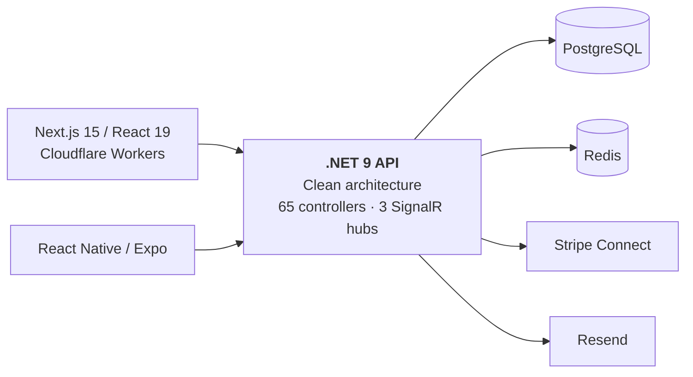

Four backend projects with inward-pointing dependencies. `Domain` references no infrastructure at
all. A club is the tenant, and isolation is enforced at three independent layers: a global MVC
filter comparing the route's `{clubId}` against the JWT claim, authorization policies, and composite
`(ClubId, …)` unique constraints.

→ [ARCHITECTURE.md](./portfolio/ARCHITECTURE.md) covers the layering and request flow ·
[ENGINEERING.md](./portfolio/ENGINEERING-LOG.md#multi-tenancy-without-global-query-filters) explains
why
EF global query filters were rejected for tenant isolation

---

## Stack

**Backend**: .NET 9, EF Core 9, PostgreSQL, Redis, SignalR, Stripe.NET, Serilog, Sentry, NUnit
**Web**: Next.js 15, React 19, TypeScript 5.9, Tailwind 3.4, Radix UI, TanStack Query,
Chart.js/Recharts/D3, Jest, MSW, Playwright
**Mobile**: Expo 54, React Native 0.81, React Navigation 6, Stripe React Native, expo-secure-store
**Infra**: Cloudflare Workers via OpenNext, Railway, Docker

---

## Where the thirteen months went

Built by one person. The commit history runs from 2025-05-28 to 2026-08-07; feature work stopped on
2026-07-08, and everything after that date is documentation and repository cleanup. The product was
never commercially launched, and the mobile app was never submitted to either app store.

Two things account for most of that time.

**The database changed underneath the project.** GatherGrove ran on SQL Server for its first nine
months and cut over to PostgreSQL on 2026-02-17. The cutover commit was a day's work. The type
mismatches (`ntext`, `nvarchar(max)`) were an afternoon, and the migration failing to apply found
them. The semantic difference took five weeks. PostgreSQL's `timestamptz` rejects a `DateTime` whose
`Kind` is `Unspecified`, and SQL Server accepts it silently, so nine months of analytics and
reporting code had been written against a database that never forced the question. It surfaced as a
dashboard crash rather than a compile error, because the failure only happens once a value reaches
the driver. The fix threaded `DateTimeKind.Utc` through six services.

→ [ENGINEERING.md](./portfolio/ENGINEERING-LOG.md#migrating-from-sql-server-to-postgresql) gives the
  full account with the commit hashes for the cutover, the type fixes, and the five-week tail

**Most of the work was not new features.** By conventional-commit type the 2,130 commits break down
as 421 `fix`, 406 `test`, 163 `docs`, and 89 `feat`. That is roughly five fixes and five test
commits for every feature commit, which is the shape of the thirteen months more than any feature
list is.

This repository is a single-commit snapshot, so its own log shows one commit rather than the 2,130
above. Those come from the private repository it was taken from.

---

## By the numbers

Every figure below came from a command run against this repository. Where reality is less flattering
than the project's own documentation claimed, the measured number is the one printed here.

### Code

| | Production | Tests |
|---|---:|---:|
| Backend (C#) | 122,466 | 195,282 |
| Web client (TS/TSX) | 170,792 | 182,181 |
| Mobile (TS/TSX) | 36,173 | 85,967 |
| Shared design tokens | 1,750 | n/a |
| **Total** | **331,181** | **463,430** |

Plus 24,479 lines of EF Core migrations. **There is 1.4× more test code than production code.**

### Tests and coverage

| Suite | Framework | Tests passing |
|---|---|---:|
| Backend | NUnit | 6,193 |
| Web client | Jest · RTL · MSW | 10,932 |
| Mobile | Jest · RNTL | 5,605 |
| E2E | Playwright | 41 |

Skipped: 20 backend, 121 client, 266 mobile. Backend failures: 0.

No line-coverage percentage is published here. Four backend test projects each emit their own
Cobertura report, `client/jest.config.js` configures an 80% global threshold, and mobile carries the
same Jest coverage setup, but no Cobertura, lcov, or Jest coverage report is committed anywhere in
this tree: coverage output is build-generated and gitignored, same as `bin/`, `obj/`, and
`node_modules/`. A percentage without a committed report to check it against is not something this
pass could confirm, so it is not printed as a headline number. See
[`portfolio/METRICS.md`](portfolio/METRICS.md#coverage-tooling) for what the tree does contain.

### Surface area

| | |
|---|---:|
| API controllers | 65 |
| HTTP endpoints | 384 |
| Domain entities | 85 |
| Database tables | 84 |
| Service interfaces | 108 |
| SignalR hubs | 3 |
| Next.js routes | 119 |
| React components | 251 |
| Commits | 2,130 |

Those 2,130 commits land across 150 days with at least one commit, and break down by
conventional-commit type as 421 `fix`, 406 `test`, 163 `docs`, 89 `feat`. See [Where the thirteen
months went](#where-the-thirteen-months-went) for the dates and what that ratio means.

---

## Testing

Mocks stop at system boundaries. HTTP is intercepted with MSW so components, hooks, and services
execute for real; external APIs like Stripe are mocked, internal services are not. Backend service
tests use in-memory EF Core and assert against persisted rows rather than verifying that a mock was
called.

`.githooks/pre-commit` reads the staged file list and runs only the gates for layers that changed. A
CSS tweak does not trigger a .NET build. The gates themselves run sequentially.

Feature work happens in git worktrees created by `scripts/new-worktree.sh`, which copies environment
files, installs dependencies, and wires hooks.

→ [ENGINEERING.md](./portfolio/ENGINEERING-LOG.md#testing-mocks-stop-at-boundaries) covers the
  boundary
  rule and where this codebase breaks its own version of it ·
[portfolio/TESTING.md](./portfolio/TESTING.md) has the full suite-by-suite breakdown

---

## Screenshots

<table>
<tr>
<td width="50%" valign="top">

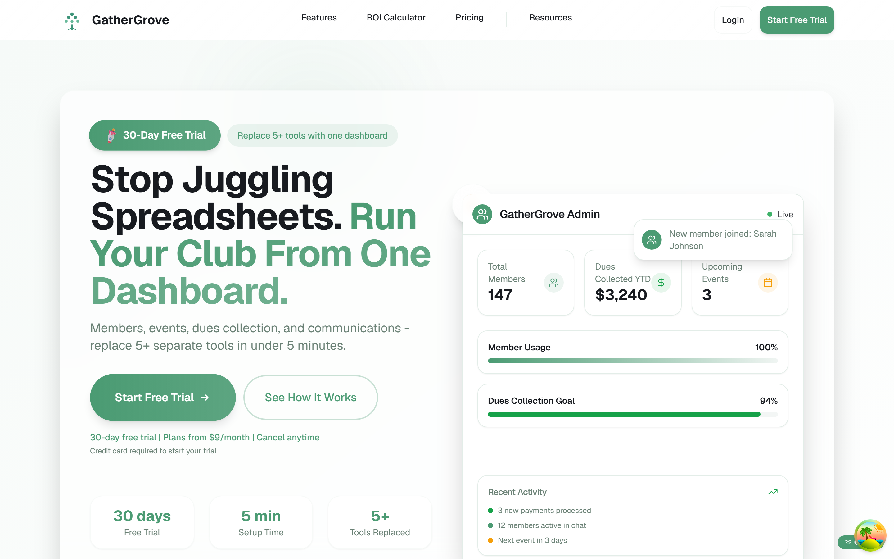

**Public marketing site**: hero, feature sections, live dashboard preview

</td>
<td width="50%" valign="top">

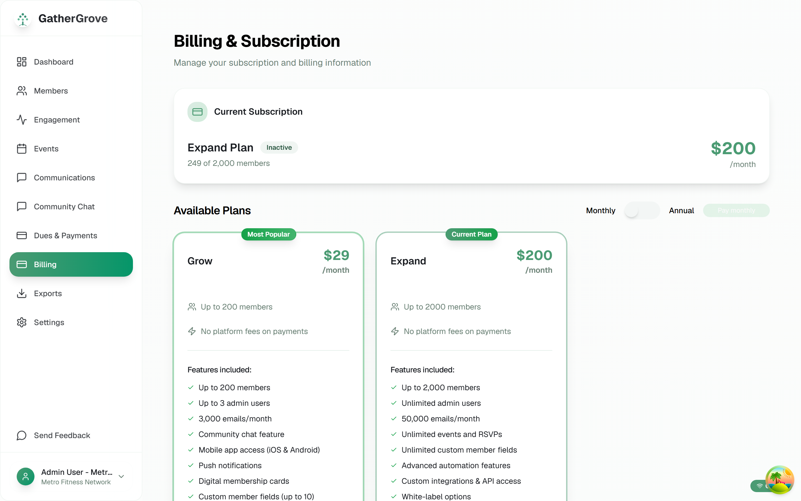

**Billing**: Stripe-backed plan comparison and subscription state

</td>
</tr>
<tr>
<td colspan="2" valign="top">

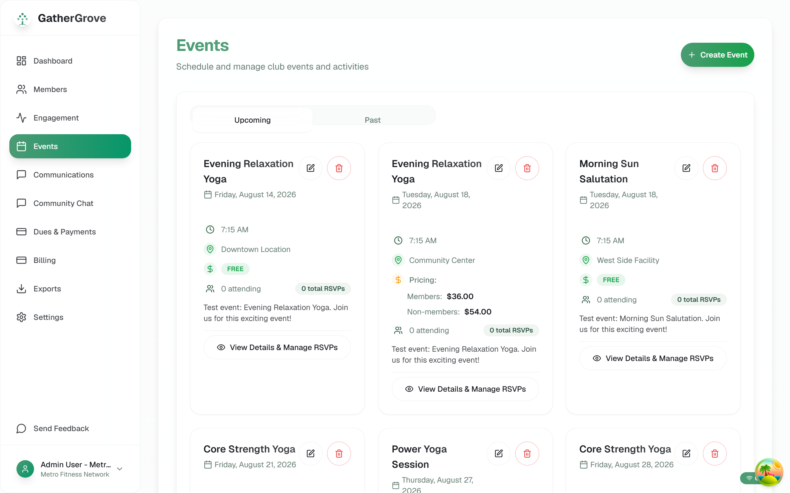

**Events**: recurring series, member vs. non-member pricing, per-location scheduling

</td>
</tr>
<tr>
<td colspan="2" valign="top" align="center">

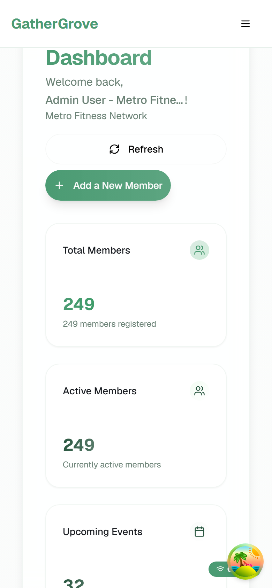

**Responsive admin**: the same dashboard at mobile width

</td>
</tr>
</table>

<details>
<summary>More screenshots</summary>

<table>
<tr>
<td width="50%" valign="top">

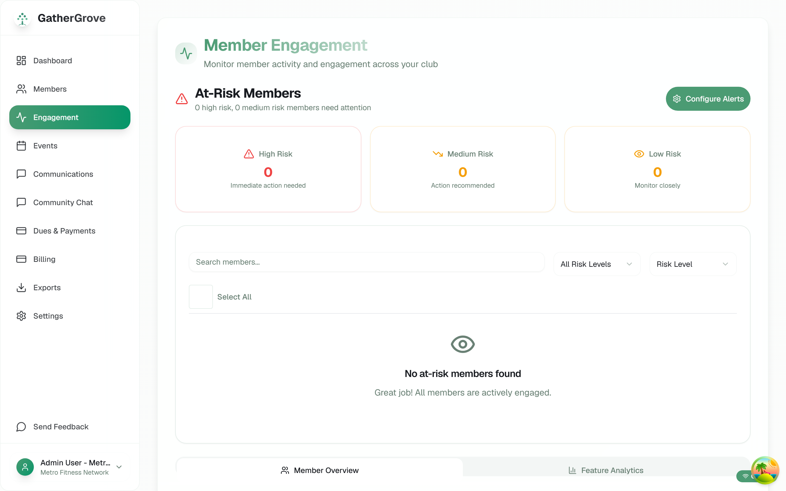

**Engagement tracking**: scoring with at-risk detection

</td>
<td width="50%" valign="top">

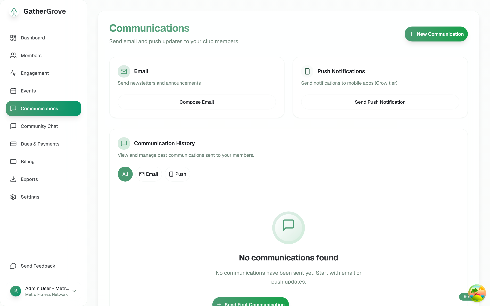

**Communications**: campaigns, scheduling, delivery

</td>
</tr>
<tr>
<td width="50%" valign="top">

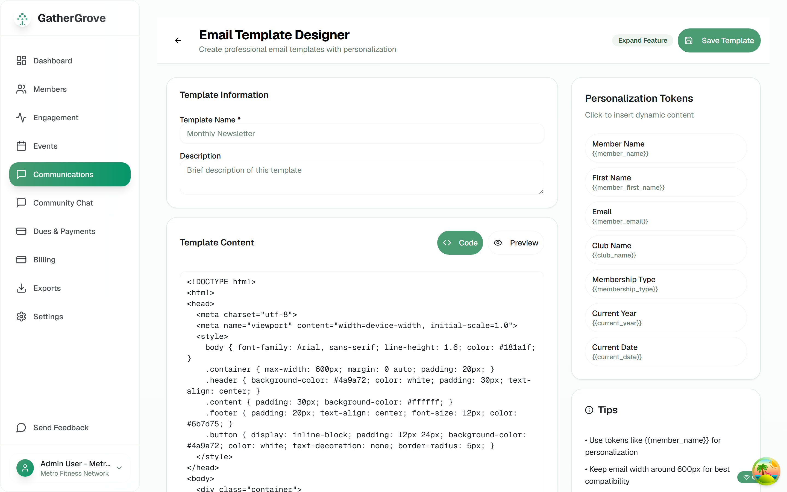

**Email designer**: template builder with personalization tokens

</td>
<td width="50%" valign="top">

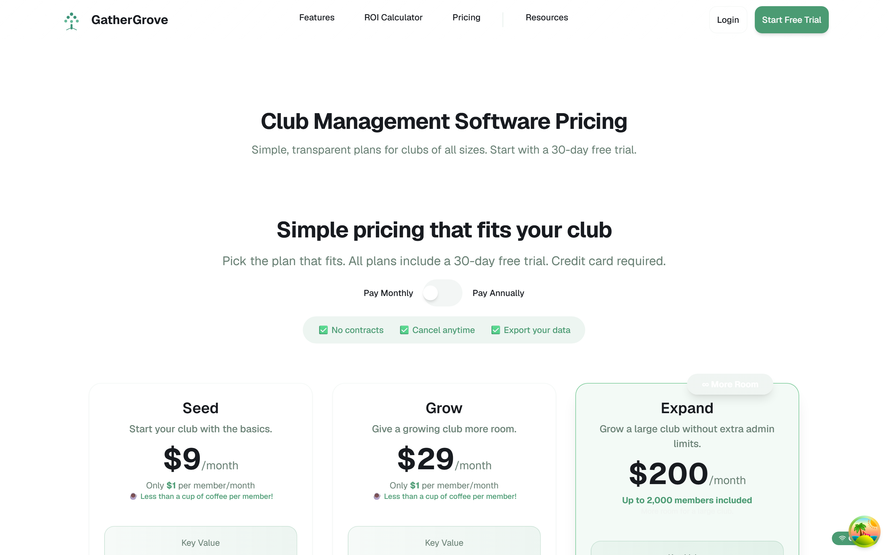

**Pricing**: three tiers with feature gating

</td>
</tr>
<tr>
<td colspan="2" valign="top">

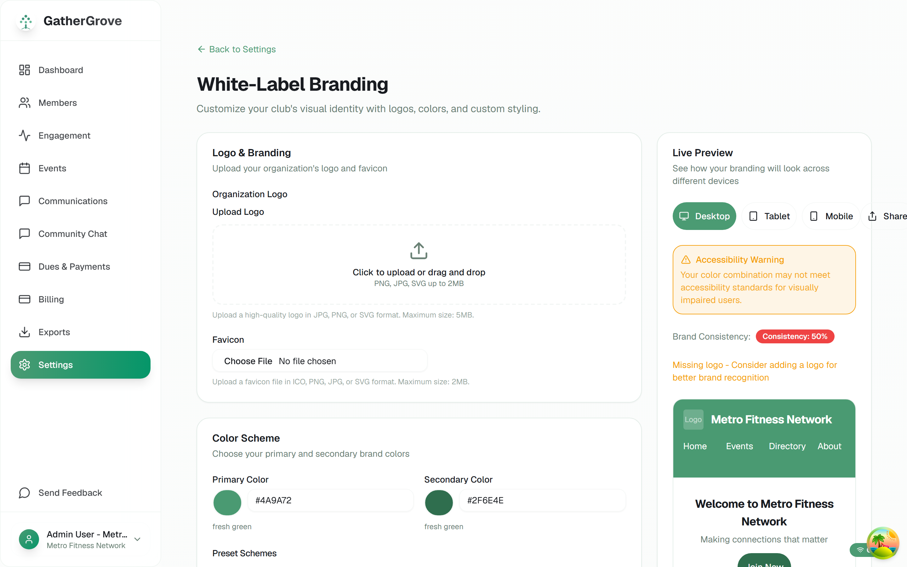

**White-label branding**: per-club colors, with a live preview that flags contrast and
brand-consistency problems as you edit

</td>
</tr>
<tr>
<td colspan="2" valign="top" align="center">

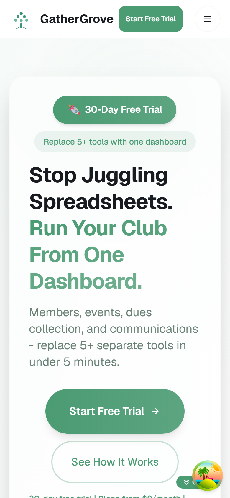

**Marketing site at mobile width**

</td>
</tr>
</table>

</details>

The captures above cover the marketing site, billing, events, member engagement,
communications, the email designer, pricing, and white-label branding, all taken locally against
the seeded database.

---

## Repository map

```text
backend/      .NET 9 API. Domain, Application, Infrastructure, API
client/       Next.js 15 / React 19 web app, deployed to Cloudflare Workers
mobile/       React Native / Expo app. Never published to an app store
shared/       Design tokens compiled to CSS, TypeScript, and C#
e2e/          Playwright specs and the screenshot capture script
tests/        Cross-cutting suites: integration, services, A/B testing
scripts/      Seeding, quality gates, worktree setup
portfolio/    The write-ups linked below, plus portfolio/screenshots/
docs/         Working notes: plans, guides, sprint docs, archived reports
GatherGrove Assets/   Source brand/logo files. Stays at root because mobile/generate-icons.js
                      reads from it by relative path; see mobile/README-ICONS.md
```

## Documentation

`portfolio/` is retrospective and reader-facing: finite write-ups where every claim traces to a file
or a command. `docs/` is prospective working residue: dated plans, guides, and superseded reports
kept for their evidence value. The file-by-file index lives in
[`portfolio/README.md`](./portfolio/README.md); the working-notes index is
[`docs/README.md`](./docs/README.md). The trade-offs and unresolved bugs found while building this
are in [ENGINEERING-LOG.md's Known
compromises](./portfolio/ENGINEERING-LOG.md#known-compromises), file by file, with the reasoning
behind each.

---

## Built with AI agents

This repository was built with AI coding agents doing most of the typing, across tool
configurations that are committed on purpose and reviewed like source, not scrubbed to look
hand-written: `CLAUDE.md` and `AGENTS.md` (Claude Code and Codex), `.codex/skills/` (Codex skill
definitions), `.cursorrules` and `.cursor/rules/` (Cursor), and
`.github/instructions/angel.instructions.md` (Copilot-style instructions). None of them were edited
for a portfolio audience. `.cursor/rules/` still cites a `/docs/user-stories/` path this snapshot's
own `docs/` tree does not fully mirror, left as it was actually used rather than cleaned up.

No number survives the squash to one commit: this snapshot's own log shows a single commit, so there
is no way to say what share of the underlying 2,130 commits (broken down under [Where the thirteen
months went](#where-the-thirteen-months-went)) were agent-authored versus hand-edited. Stating that
plainly beats inventing a percentage.

One concrete thing the process enforced: `.githooks/pre-commit` blocks a commit outright if
`dotnet format --verify-no-changes`, `dotnet build`, or `dotnet test` fails on a staged backend
change, or if `npm run lint`, `npm run typecheck`, `npm test`, or `npm run build` fails on a staged
client change, and it is scoped, so a CSS-only commit never triggers the .NET build (see
[Testing](#testing)). `CLAUDE.md`'s "boundary mocking" rule (mock only external APIs and native
modules, never internal services) was a real, written-down gate rather than filler advice: it is the
reason the sixteen globally mocked Radix UI packages are recorded in [TESTING.md's boundary-mocking
rule](./portfolio/TESTING.md#the-boundary-mocking-rule) instead of silently left out, because a rule
that is written down can be checked against the code that violates it.

---

## Running it locally

Requires .NET 9 SDK, Node 20 (see `.nvmrc`), and Docker.

```bash
docker compose up -d postgres
```

```bash
cd backend && dotnet ef database update --project src/GatherGrove.Infrastructure --startup-project src/GatherGrove.API
```

```bash
cd backend/src/GatherGrove.API && dotnet run
```

```bash
cd client && npm install && npm run dev
```

The API listens on `:8050`, the web client on `:3050`. To populate a realistic dataset (three clubs
across all pricing tiers, with members, events, and campaigns):

```bash
pwsh scripts/seed-database.ps1 -ConfigPath ./scripts/config/seed-config.json
```

Run the quality gates:

```bash
./scripts/check.sh
```

---

## Who built this

GatherGrove was designed, built, and tested by one person: Angel Campa. I can walk through the
private commit history, the SQL Server to PostgreSQL migration, or any decision in
[portfolio/ENGINEERING-LOG.md](./portfolio/ENGINEERING-LOG.md) on request:
[github.com/AngelCampa1](https://github.com/AngelCampa1).

---

## License

Source-available for viewing and evaluation. Not open source: no redistribution, derivative works,
or commercial use. See [LICENSE](LICENSE).
