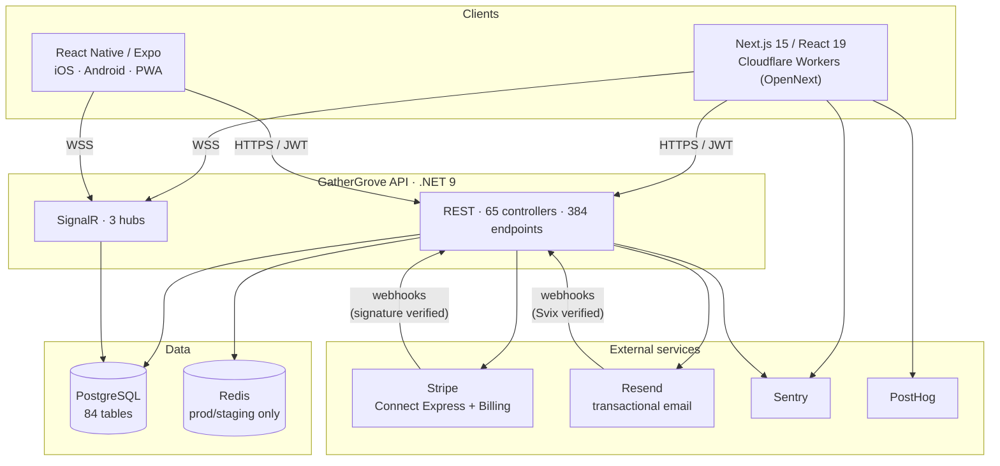
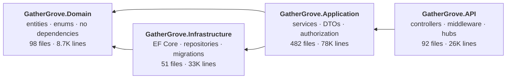
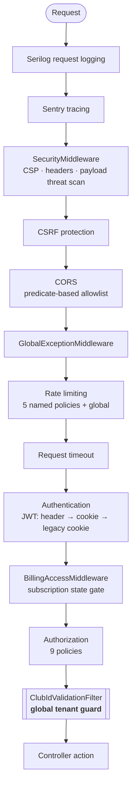
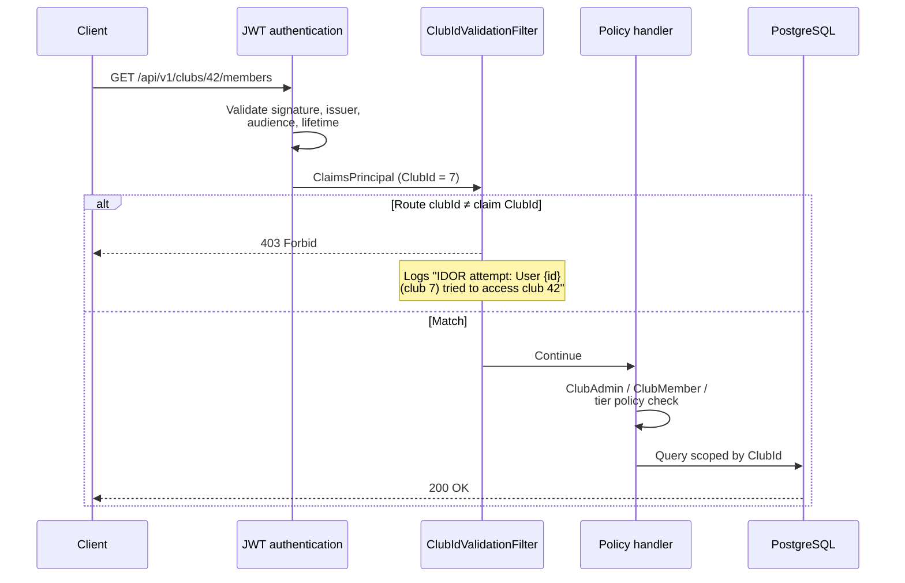
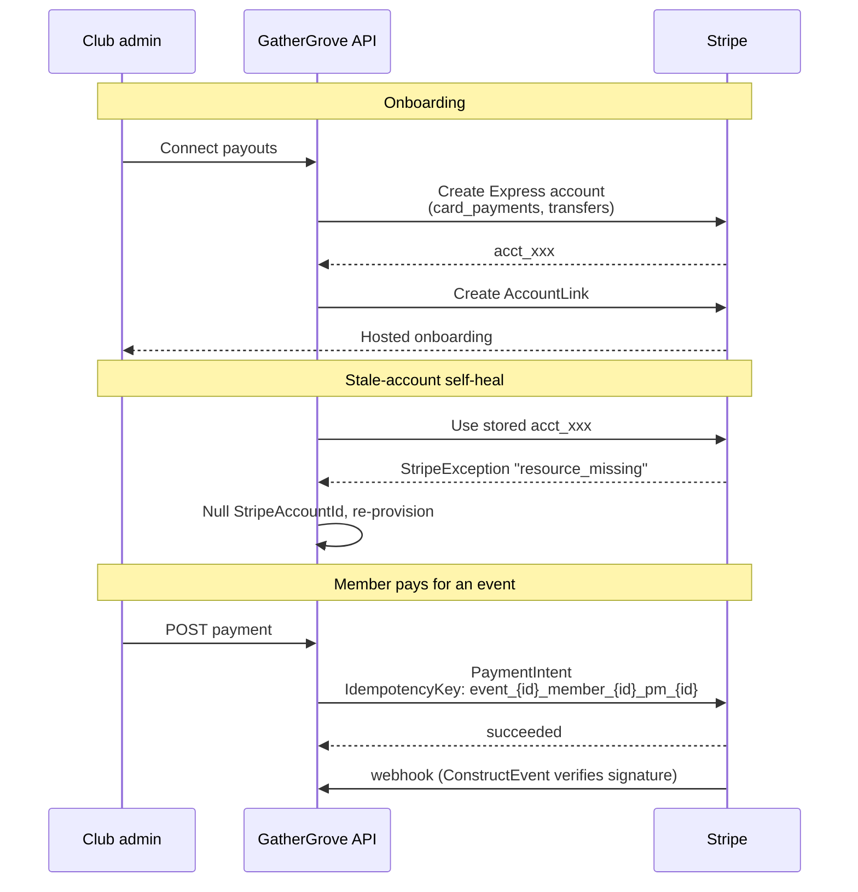
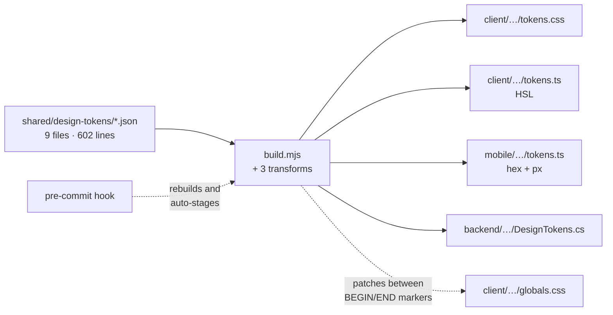
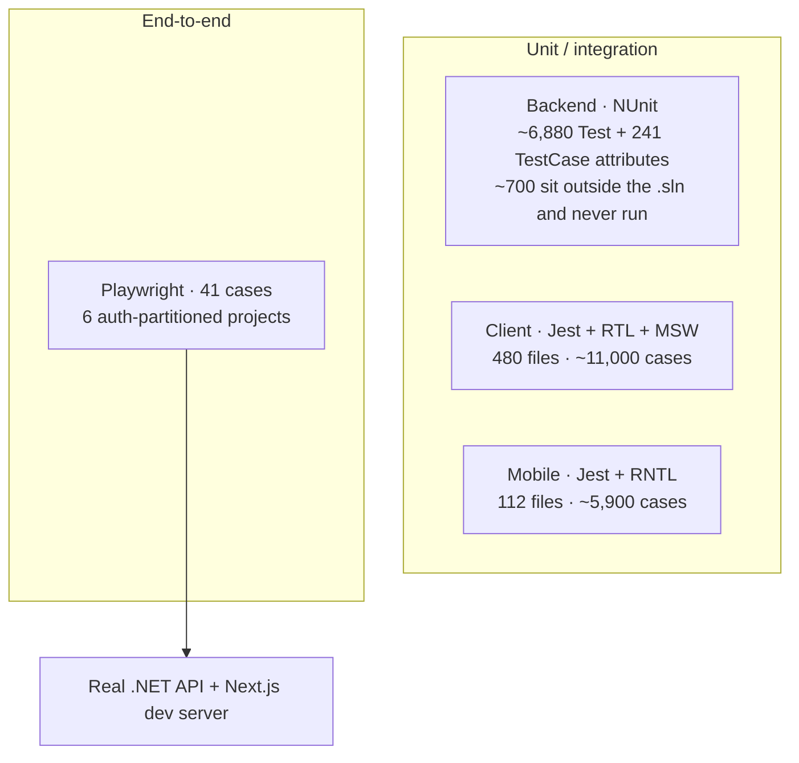

# Architecture

GatherGrove is a multi-tenant SaaS for membership and event management. Three clients (web, mobile,
public marketing site) talk to one .NET API over HTTPS and WebSockets, backed by PostgreSQL.

This document covers structure and request flow. For *why* particular decisions were made, see
[ENGINEERING.md](./ENGINEERING-LOG.md).

---

## System context

The web client is server-rendered at the edge on Cloudflare Workers. Next's built-in image optimizer
needs a Node runtime that Workers does not provide, so optimization is turned off through a custom
loader (`client/src/lib/cloudflare-image-loader.ts`) that returns the source URL untouched.
Cloudflare's own `/cdn-cgi/image/` resizing would be the real fix, but it needs a paid plan, so the
loader is a free-tier stopgap rather than a delegation.

---

## Backend: layering

Four projects. `Domain` depends on nothing: no EF Core, no ASP.NET, no Stripe, and zero NuGet
packages in its `.csproj`.

The dependency graph is not textbook clean architecture, and the diagram below shows what the
`.csproj` files actually declare rather than what the pattern prescribes.

`Application` takes a project reference on `Infrastructure`, which inverts the dependency rule: the
inner layer should not know about the outer one. The correct shape is repository interfaces declared
in `Application` and implemented in `Infrastructure`, with the composition root wiring them
together. Services here take `GatherGroveDbContext` directly instead, so the abstraction was never
introduced and the reference is load-bearing. Undoing it now means touching most of the 93 services,
which is why it has not been undone. It is listed under Known compromises rather than glossed over,
because the `.csproj` graph is the first thing a reviewer checks.

| Layer | Contents |
|---|---|
| **Domain** | 85 entities, 34 enums. Plain C#, zero infrastructure dependencies. |
| **Application** | 93 services behind 108 interfaces, 717 DTOs, authorization handlers, caching, exports. |
| **Infrastructure** | `GatherGroveDbContext` (84 `DbSet`s, 2,158 lines), 13 repositories, EF migrations. |
| **API** | 65 controllers, 3 SignalR hubs, 12 middleware components, DI composition. |

---

## Request pipeline

Order matters here, and this is the actual registration order from `Program.cs`:

Rate limiting runs as two independent systems: the built-in .NET limiter with five named policies
(`AuthApi` 10/min, `StrictApi` 5/min, `GeneralApi` 100/min, `WebVitals` 50/min, `WebhookApi` 60/min)
plus a global 1000/hour cap, and an authored `RateLimitingMiddleware` that absorbs `.well-known`
SSL-reconnaissance probes.

---

## Multi-tenancy

A "club" is the tenant. Isolation is enforced at three independent layers rather than through EF
global query filters. That is a deliberate choice, explained in
[ENGINEERING.md](./ENGINEERING-LOG.md#multi-tenancy-without-global-query-filters).

**Layer 1, the route guard.** `ClubIdValidationFilter` is registered globally as an MVC action
filter. Any route carrying `{clubId}` has it compared against the caller's `ClubId` claim; a
mismatch returns `Forbid` and logs the attempt as an IDOR probe. Escape hatches are explicit:
`[SkipClubIdValidation]`, the `PlatformAdmin` role, anonymous endpoints, and test auth schemes.

**Layer 2, authorization policies.** Nine policies (`ClubAdmin`, `ClubMember`, `GrowTierRequired`,
`UnlimitedTier`, `SelfAccess`, …) with handlers in `Application/Authorization/`, resolving
membership through `ClubAuthorizationService`.

**Layer 3, the schema.** `ClubId` is non-nullable with cascade foreign keys, and uniqueness is
composite: `(ClubId, Email)` on members, `(ClubId, Name)` on membership types, `(UserId, ClubId)` on
club admins.

---

## Payments

Stripe Connect Express, so each club is its own connected account receiving funds directly. The
platform never takes custody.

Three details worth noting:

- **Idempotency keys are derived, not random**:
  `event_{eventId}_member_{memberId}_pm_{paymentMethodId}` for charges and
  `refund_rsvp_{rsvpId}_{paymentIntentId}` for refunds. A retried request produces the same key, so
  Stripe collapses it rather than double-charging.
- **Webhook signatures are verified**, never trusted by shape: `EventUtility.ConstructEvent(json,
  signature, webhookSecret)` on the raw body. Resend's webhooks get the same treatment via Svix.
- **Connected accounts self-heal.** If a stored account ID no longer exists in Stripe, the service
  catches `resource_missing`, clears the stale ID, and re-provisions instead of failing the request.

---

## Real-time

Three SignalR hubs, group-scoped per club or per event, with a 15s keepalive and 30s client timeout.

| Hub | Endpoint | Purpose |
|---|---|---|
| `ChatHub` | `/chatHub` | Club chat rooms, join/leave authorization |
| `EventEngagementHub` | `/eventEngagementHub` | Live event engagement, recommendations |
| `AnalyticsHub` | `/hubs/analytics` | Server-pushed metric streams |

`AnalyticsHub` streams rather than polls: `StreamEngagementMetrics`, `StreamCohortAnalysis`,
`StreamROIMetrics`, `StreamMemberSegmentation`. Application-layer code broadcasts through
`ChatBroadcastService` so it never takes a direct SignalR dependency.

---

## Design tokens

One source of truth compiles to four platform targets, so a color defined once reaches web, mobile,
and server-rendered email without hand-copying.

Transforms handle the platform mismatches: hex→HSL for CSS custom properties, and an abstract shadow
model→React Native `elevation`/`shadowOffset`. The pre-commit hook rebuilds and re-stages all four
outputs whenever a token source changes, so generated files cannot drift from their source.

---

## Testing topology

The guiding rule is that mocks stop at system boundaries. HTTP is intercepted with MSW so services,
hooks, and components execute for real; external APIs like Stripe are mocked; internal services are
not. Playwright partitions its 41 cases into six projects by required auth state, with a setup
project minting admin and member storage states up front.

---

## Deployment

| Component | Target |
|---|---|
| Web client | Cloudflare Workers via OpenNext (`wrangler.jsonc`), custom domains `gathergrove.club` / `www` |
| API | Railway |
| Database | PostgreSQL (Neon serverless in production) |
| Mobile | EAS Build profiles configured; **never published to app stores** |

Quality gates run locally rather than in hosted CI, a deliberate project constraint.
`.githooks/pre-commit` is change-scoped: it inspects staged paths and runs only the affected layer's
gate. The gates run sequentially; the per-track log files look like scaffolding for a parallel
version that was never wired up. `scripts/check.sh` runs the same gates on demand.
