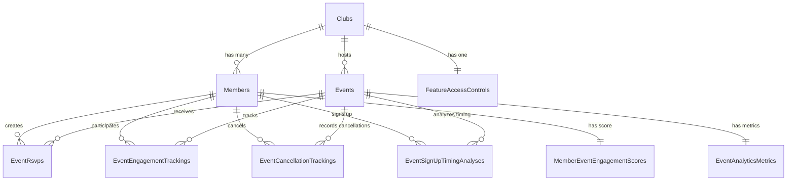

# Event Engagement Analytics - Entity Relationship Diagram

> Companion to [ENGAGEMENT-ANALYTICS-SCHEMA.md](./ENGAGEMENT-ANALYTICS-SCHEMA.md), which lists
> table by table which of these entities actually reached the database. Four of them did not.

## Database Schema Visualization

### Entity relationships

Cardinalities only, no attribute lists, so the shape of the model stays readable. Which of these
thirteen relationships the database actually enforces is covered in
[Relationship enforcement](#relationship-enforcement) below. Five of them exist only as design
intent, because the entity on one end was never mapped.

### Entity attributes

Field lists for each entity above, split out of the diagram so the relationship shape isn't
buried under them. Mapped/unmapped status matches the table in
[ENGAGEMENT-ANALYTICS-SCHEMA.md](./ENGAGEMENT-ANALYTICS-SCHEMA.md).

### Clubs (mapped)

| Field | Type | Key |
|---|---|---|
| `Id` | int | PK |
| `Name` | string |  |
| `Description` | string |  |
| `CreatedAt` | datetime |  |
| `UpdatedAt` | datetime |  |

### Members (mapped)

| Field | Type | Key |
|---|---|---|
| `Id` | int | PK |
| `ClubId` | int | FK |
| `FirstName` | string |  |
| `LastName` | string |  |
| `Email` | string |  |
| `JoinedAt` | datetime |  |
| `CreatedAt` | datetime |  |
| `UpdatedAt` | datetime |  |

### Events (mapped)

| Field | Type | Key |
|---|---|---|
| `Id` | int | PK |
| `ClubId` | int | FK |
| `Name` | string |  |
| `EventDateTime` | datetime |  |
| `Location` | string |  |
| `Description` | string |  |
| `MaxCapacity` | int |  |
| `IsFeatured` | bool |  |
| `CreatedAt` | datetime |  |
| `UpdatedAt` | datetime |  |

### EventRsvps (mapped)

| Field | Type | Key |
|---|---|---|
| `Id` | int | PK |
| `EventId` | int | FK |
| `MemberId` | int | FK |
| `RsvpStatus` | string |  |
| `Notes` | string |  |
| `CreatedAt` | datetime |  |
| `UpdatedAt` | datetime |  |

### EventEngagementTrackings (mapped)

| Field | Type | Key |
|---|---|---|
| `Id` | int | PK |
| `EventId` | int | FK |
| `MemberId` | int | FK |
| `RegistrationStatus` | string |  |
| `AttendanceStatus` | string |  |
| `AttendancePercentage` | decimal |  |
| `CheckInTimestamp` | datetime |  |
| `CheckOutTimestamp` | datetime |  |
| `SessionDurationMinutes` | int |  |
| `InteractionCount` | int |  |
| `NetworkingConnections` | int |  |
| `ParticipationLevel` | string |  |
| `ParticipationScore` | decimal |  |
| `QuestionsAsked` | int |  |
| `PollsParticipated` | int |  |
| `ResourcesDownloaded` | int |  |
| `ChatMessages` | int |  |
| `BreakoutParticipation` | bool |  |
| `Platform` | string |  |
| `DeviceType` | string |  |
| `ConnectionQuality` | string |  |
| `TechnicalIssues` | bool |  |
| `FocusScore` | decimal |  |
| `AttentionSpan` | int |  |
| `MultitaskingDetected` | bool |  |
| `PostEventSurveyCompleted` | bool |  |
| `SatisfactionRating` | decimal |  |
| `NetPromoterScore` | int |  |
| `EngagementBoost` | decimal |  |
| `LastEngagementUpdate` | datetime |  |
| `CreatedAt` | datetime |  |
| `UpdatedAt` | datetime |  |

### EventCancellationTrackings (unmapped, no DbSet)

| Field | Type | Key |
|---|---|---|
| `Id` | int | PK |
| `EventId` | int | FK |
| `MemberId` | int | FK |
| `CancellationType` | string |  |
| `CancellationReason` | string |  |
| `CancelledAt` | datetime |  |
| `DaysBeforeEvent` | int |  |
| `HoursBeforeEvent` | int |  |
| `CancellationCategory` | string |  |
| `WasRescheduled` | bool |  |
| `RescheduledToEventId` | datetime |  |
| `MemberReliabilityScore` | decimal |  |
| `ConsecutiveCancellations` | int |  |
| `TotalCancellationsLast90Days` | int |  |
| `WasNoShow` | bool |  |
| `PartialAttendance` | bool |  |
| `AttendancePercentage` | decimal |  |
| `EventType` | string |  |
| `EventDay` | string |  |
| `EventTime` | string |  |
| `WasEventCancelled` | bool |  |
| `ImpactOnEngagementScore` | decimal |  |
| `TriggeredAlert` | bool |  |
| `FollowUpSent` | bool |  |
| `FollowUpSentAt` | datetime |  |
| `FollowUpResponse` | string |  |
| `FutureNoShowProbability` | decimal |  |
| `RiskCategory` | string |  |
| `CreatedAt` | datetime |  |
| `UpdatedAt` | datetime |  |

### EventSignUpTimingAnalyses (unmapped, no DbSet)

| Field | Type | Key |
|---|---|---|
| `Id` | int | PK |
| `EventId` | int | FK |
| `MemberId` | int | FK |
| `SignUpTimestamp` | datetime |  |
| `DaysBeforeEvent` | int |  |
| `HoursBeforeEvent` | int |  |
| `MinutesBeforeEvent` | int |  |
| `TimingCategory` | string |  |
| `SignUpWindow` | string |  |
| `MemberAvgDaysBeforeSignUp` | decimal |  |
| `MemberSignUpPattern` | string |  |
| `MemberTotalEventSignUps` | int |  |
| `EventType` | string |  |
| `EventCapacityWhenSigned` | decimal |  |
| `EventTotalSignUpsAtTime` | int |  |
| `WasWaitlisted` | bool |  |
| `WaitlistPosition` | int |  |
| `PredictedEngagementScore` | decimal |  |
| `ActualEngagementScore` | decimal |  |
| `EngagementPredictionAccuracy` | decimal |  |
| `PredictedAttendanceProbability` | decimal |  |
| `ActuallyAttended` | bool |  |
| `AttendancePredictionAccuracy` | decimal |  |
| `SignUpTrigger` | string |  |
| `SignedUpViaNotification` | bool |  |
| `SignedUpAfterReminder` | bool |  |
| `ReminderCount` | int |  |
| `FriendsAlreadySignedUp` | int |  |
| `InfluencedByFriends` | bool |  |
| `SocialInfluenceFactors` | string |  |
| `Platform` | string |  |
| `DeviceType` | string |  |
| `TimeOfDay` | string |  |
| `DayOfWeek` | string |  |
| `SignUpEfficiencyScore` | decimal |  |
| `SignUpSuccessCategory` | string |  |
| `CreatedAt` | datetime |  |
| `UpdatedAt` | datetime |  |

### EventAnalyticsMetrics (mapped)

| Field | Type | Key |
|---|---|---|
| `Id` | int | PK |
| `EventId` | int | FK |
| `ClubId` | int | FK |
| `TotalRegistrations` | int |  |
| `TotalAttendees` | int |  |
| `AttendanceRate` | decimal |  |
| `NoShowRate` | decimal |  |
| `AverageParticipationScore` | decimal |  |
| `AverageSessionDuration` | int |  |
| `TotalInteractions` | int |  |
| `UniqueParticipants` | int |  |
| `AverageSatisfactionRating` | decimal |  |
| `AverageNPS` | decimal |  |
| `SurveyResponseRate` | decimal |  |
| `HighlyActiveCount` | int |  |
| `ActiveCount` | int |  |
| `ModerateCount` | int |  |
| `PassiveCount` | int |  |
| `DisengagedCount` | int |  |
| `MobileUsagePercentage` | decimal |  |
| `TechnicalIssuesCount` | int |  |
| `NetworkingConnectionsMade` | int |  |
| `ResourceDownloads` | int |  |
| `FollowUpEngagements` | int |  |
| `TotalEngagementBoost` | decimal |  |
| `AverageEngagementBoost` | decimal |  |
| `MembersWithBoost` | int |  |
| `ComparedToClubAverage` | decimal |  |
| `ComparedToEventType` | decimal |  |
| `EventSuccessScore` | decimal |  |
| `CalculatedAt` | datetime |  |
| `CreatedAt` | datetime |  |
| `UpdatedAt` | datetime |  |

### MemberEventEngagementScores (mapped)

| Field | Type | Key |
|---|---|---|
| `Id` | int | PK |
| `MemberId` | int | FK |
| `TotalEventsAttended` | int |  |
| `EventAttendanceRate` | decimal |  |
| `AverageEventEngagementScore` | decimal |  |
| `PreferredEventTypes` | string |  |
| `PreferredEventTimes` | string |  |
| `ConsistencyScore` | decimal |  |
| `HighEngagementEventsCount` | int |  |
| `LowEngagementEventsCount` | int |  |
| `AverageSatisfactionRating` | decimal |  |
| `NetworkingScore` | decimal |  |
| `PeerInfluenceScore` | decimal |  |
| `CommunityContribution` | decimal |  |
| `EventRetentionProbability` | decimal |  |
| `EngagementTrend` | string |  |
| `RiskLevel` | string |  |
| `Recent90DayEvents` | int |  |
| `Recent90DayEngagementScore` | decimal |  |
| `Recent90DayTrend` | decimal |  |
| `ContributionToOverallScore` | decimal |  |
| `LastEngagementScoreUpdate` | datetime |  |
| `CalculatedAt` | datetime |  |
| `CreatedAt` | datetime |  |
| `UpdatedAt` | datetime |  |

### FeatureAccessControls (unmapped, no DbSet)

| Field | Type | Key |
|---|---|---|
| `Id` | int | PK |
| `ClubId` | int | FK |
| `SubscriptionTier` | string |  |
| `TierStartDate` | datetime |  |
| `TierEndDate` | datetime |  |
| `IsActive` | bool |  |
| `EventAnalyticsAccess` | bool |  |
| `AdvancedEngagementMetrics` | bool |  |
| `PredictiveAnalytics` | bool |  |
| `CustomEngagementReports` | bool |  |
| `RealTimeEngagementTracking` | bool |  |
| `DataExportAccess` | bool |  |
| `APIAccess` | bool |  |
| `WebhooksAccess` | bool |  |
| `ThirdPartyIntegrations` | bool |  |
| `MaxHistoricalDataMonths` | int |  |
| `MaxMemberEngagementProfiles` | int |  |
| `MaxCustomDashboards` | int |  |
| `MaxAutomatedReports` | int |  |
| `MemberSegmentationAccess` | bool |  |
| `EngagementScoringCustomization` | bool |  |
| `MachineLearningInsights` | bool |  |
| `PredictiveNoShowModels` | bool |  |
| `SentimentAnalysis` | bool |  |
| `CompetitiveAnalytics` | bool |  |
| `EngagementAlertsAccess` | bool |  |
| `MaxAlertRules` | int |  |
| `CustomAlertActions` | bool |  |
| `SlackIntegration` | bool |  |
| `EmailReporting` | bool |  |
| `MaxAPICallsPerMonth` | int |  |
| `MaxDataExportsPerMonth` | int |  |
| `MaxConcurrentUsers` | int |  |
| `CurrentAPICallsThisMonth` | int |  |
| `CurrentDataExportsThisMonth` | int |  |
| `CurrentActiveUsers` | int |  |
| `LastAPICall` | datetime |  |
| `LastDataExport` | datetime |  |
| `MonthlyFee` | decimal |  |
| `AnnualFee` | decimal |  |
| `AutoRenewal` | bool |  |
| `LastBillingDate` | datetime |  |
| `NextBillingDate` | datetime |  |
| `IsTrialAccount` | bool |  |
| `TrialStartDate` | datetime |  |
| `TrialEndDate` | datetime |  |
| `PromoCode` | string |  |
| `DiscountPercentage` | decimal |  |
| `FeatureFlags` | string |  |
| `BetaFeaturesEnabled` | bool |  |
| `GDPRCompliant` | bool |  |
| `DataRetentionPolicyAccepted` | bool |  |
| `SecurityAuditAccess` | bool |  |
| `SupportLevel` | string |  |
| `PrioritySupport` | bool |  |
| `DedicatedAccountManager` | bool |  |
| `CreatedAt` | datetime |  |
| `UpdatedAt` | datetime |  |
| `LastFeatureCheck` | datetime |  |

## Relationship enforcement

This is the one thing the diagram above cannot show on its own: which of its thirteen relationship
lines the database actually enforces, versus which exist only as design intent. Checked against
`backend/src/GatherGrove.Infrastructure/Data/GatherGroveDbContext.cs`.

**Enforced with a real foreign key.** The four core relationships (`Clubs↔Members`,
`Clubs↔Events`, `Members↔EventRsvps`, `Events↔EventRsvps`) sit on always-mapped entities.
Among the engagement-specific tables, four more carry explicit Fluent API foreign keys with
declared delete behavior: `Events↔EventEngagementTrackings` (cascade) and
`Members↔EventEngagementTrackings` (restrict), `Events↔EventAnalyticsMetrics` (cascade, unique per
event), and `Members↔MemberEventEngagementScores` (cascade, one-to-one via a unique index on
`MemberId`). Eight of the thirteen relationships are real.

**Never enforced, because the entity was never mapped.** `Clubs↔FeatureAccessControls`,
`Members↔EventCancellationTrackings`, `Events↔EventCancellationTrackings`,
`Members↔EventSignUpTimingAnalyses`, and `Events↔EventSignUpTimingAnalyses` have no `DbSet` at
all. See the mapping table in
[ENGAGEMENT-ANALYTICS-SCHEMA.md](./ENGAGEMENT-ANALYTICS-SCHEMA.md). These five relationships exist
only in this diagram: there is no column, no constraint, and no table on one end for the database
to enforce anything against.

## Key Indexes and Performance Optimizations

### Primary Indexes
- All primary keys are clustered indexes
- Foreign keys have covering indexes
- Composite indexes on frequently queried columns

### Analytics-Optimized Indexes
- Time-based indexes for historical analysis
- Covering indexes for dashboard queries
- Partial indexes on status fields

### Query Performance Features
- Stored procedures for complex analytics
- Materialized views for dashboard data
- Partitioning by date for large tables

## Data Flow Patterns

### Real-Time Tracking
1. Member joins event → EventRsvps created
2. Member checks in → EventEngagementTrackings updated
3. Engagement activities → Real-time score updates
4. Event completion → Analytics metrics calculated

### Predictive Analytics Flow
1. Historical data aggregation
2. Pattern recognition in cancellations
3. No-show probability calculation
4. Risk category assignment
5. Automated alert triggers

### Feature Access Control
1. Club subscription tier determines access
2. Real-time feature flag checking
3. Usage limit enforcement
4. Tier-based data retention policies
